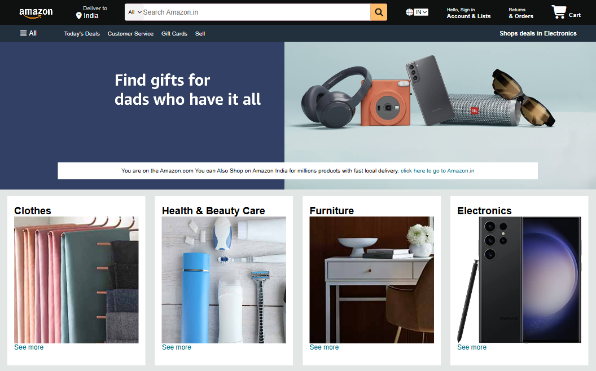

# Amazon Clone



A static Amazon-inspired landing page built with HTML, CSS, and JavaScript.

## Project Overview

This project recreates the look and feel of an Amazon homepage with:
- Top navigation bar with logo, search, account, orders, and cart sections
- Category panels for product groups like Clothes, Electronics, Toys, and more
- Hero section and footer layout
- Responsive styling using CSS

## Project Structure

```
amazonclone/
├── amazon_logo.png
├── box1_image.jpg
├── box2_image.jpg
├── box3_image.jpg
├── box4_image.jpg
├── box5_image.jpg
├── box6_image.jpg
├── box7_image.jpg
├── box8_image.jpg
├── hero_image.jpg
├── index.html
├── javaScript.js
├── style.css
└── README.md
```

## Files

- `index.html` — main page markup
- `style.css` — styles for layout, navigation, panels, and footer
- `javaScript.js` — optional JavaScript functionality
- `hero_image.jpg` — project screenshot used in this README
- `amazon_logo.png` — Amazon-style logo asset

## How to View

1. Open `index.html` in your browser.
2. Or use a local development server if available.

## Notes

- This is a front-end clone/demo and does not include actual shopping cart or backend logic.
- Images are loaded from local files in the project root.

## Author

Vishal Kashyap

Built as a simple Amazon clone project for practice and demonstration.
